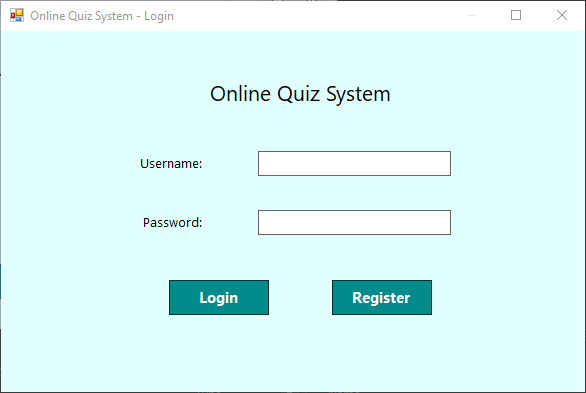
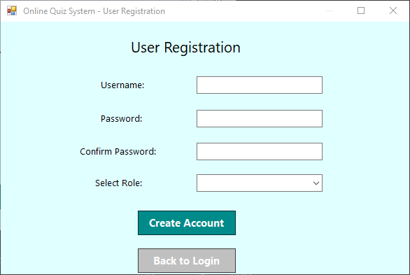
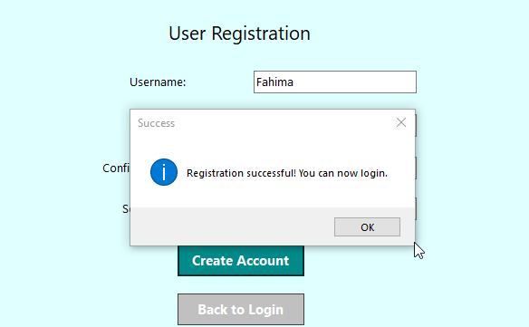
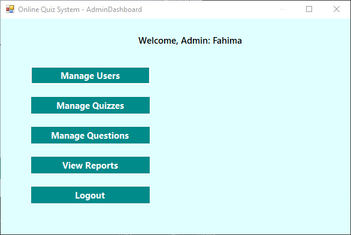
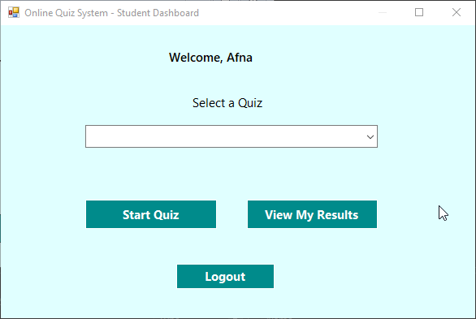
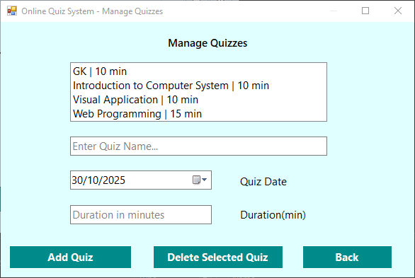
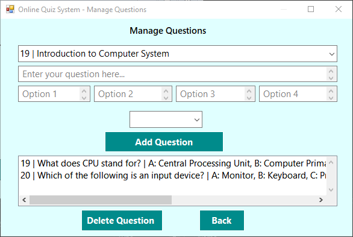
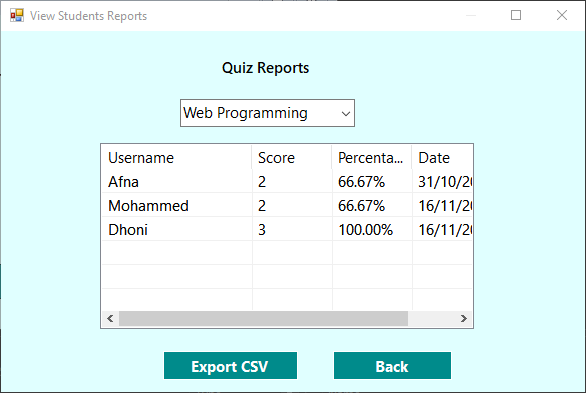
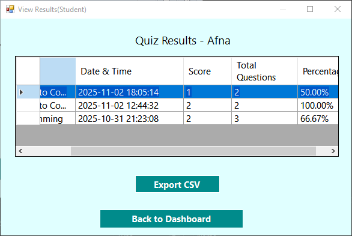

# Online Quiz System

A desktop-based quiz management application developed using C# Windows Forms and MySQL.

## 📌 Project Overview

The Online Quiz System automates the traditional quiz process by providing secure dashboards for both administrators and students.

The system supports quiz creation, question management, automatic evaluation, result generation, and reporting through an offline desktop-based solution.

---

## 🚀 Technologies Used

- C#
- .NET Framework 4.8
- Windows Forms
- MySQL
- WAMP Server
- Visual Studio 2022

---

## 🔐 Main Features

### Administrator Features
- Secure login system
- User management
- Quiz creation and deletion
- MCQ question management
- Reports and performance analysis

### Student Features
- Quiz participation
- Timer-based quiz system
- Automatic evaluation
- Instant results
- Result history
- CSV export support

---

## 🗄️ Database Features

The project uses a MySQL relational database with the following tables:

- users
- quizzes
- questions
- results

---

## 📷 System Screenshots

Below are the key interfaces of the Online Quiz System desktop application.

---

### 🔐 Login & Registration Module

  

  

#### Registration Success / Validation

  

---

### 🖥️ Dashboards

#### Admin Dashboard

  

#### Student Dashboard

  

---

### 📝 Quiz Management

#### Quizzes Module

  

#### Questions Module

  

---

### 📊 Results & Reports

  

  

## ⚙️ Installation Guide

1. Clone the repository
2. Open the project in Visual Studio 2022
3. Import `OnlineQuizSystem.sql` into MySQL using phpMyAdmin
4. Configure database connection in `App.config`
5. Run the project

---

## 🎯 Future Enhancements

- Password hashing
- Advanced analytics dashboard
- Additional question types
- Improved authentication
- Better UI/UX
- Multi-user scalability

---

## 🏆 Project Outcome

This project successfully transformed manual quiz management into a structured digital desktop application while demonstrating practical implementation of:

- C# programming
- Windows Forms development
- MySQL database integration
- Software design principles
- System testing and validation

---

## 👨‍💻 Developer

Developed as a university project using C# and MySQL.